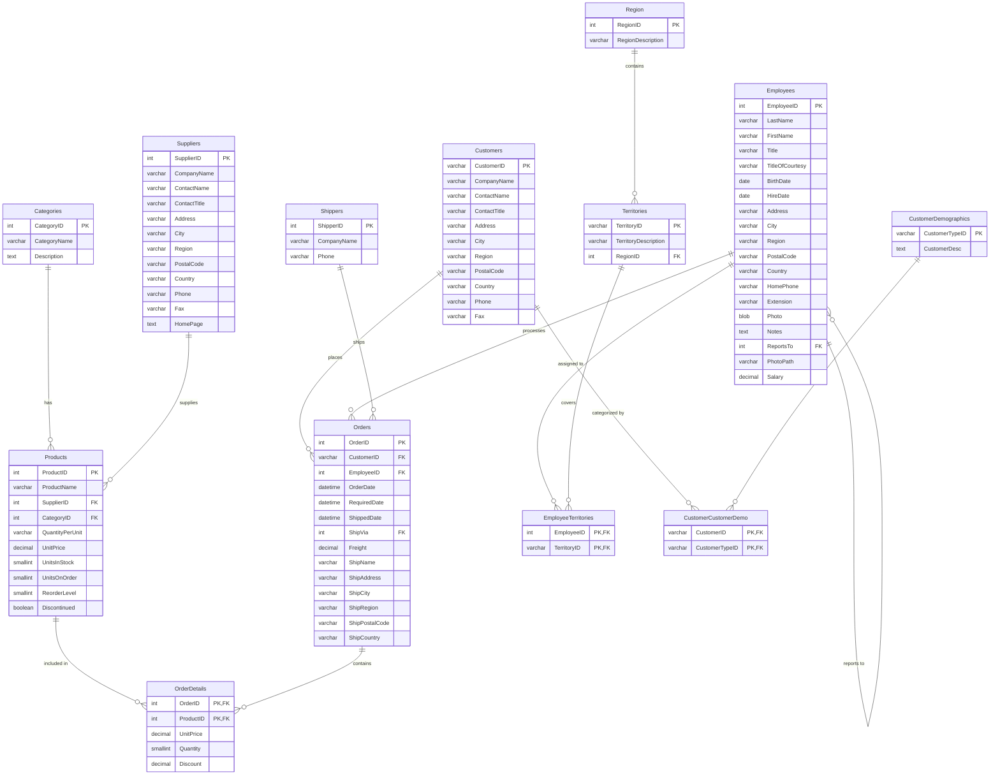

# Northwind Database ER Model

## 資料庫實體關聯圖 (Entity-Relationship Diagram)

本文檔描述 Northwind 資料庫的完整實體關聯模型，包含所有表格及其關聯關係。

## 資料表說明

### 核心業務表

| 表名 | 說明 | 主要用途 |
|------|------|----------|
| **Products** | 產品資料表 | 儲存所有產品資訊，包含定價、庫存等 |
| **Orders** | 訂單主表 | 記錄訂單基本資訊、客戶、員工、運送資訊 |
| **OrderDetails** | 訂單明細表 | 記錄訂單中的具體產品、數量、價格和折扣 |
| **Customers** | 客戶資料表 | 儲存客戶公司和聯絡資訊 |
| **Employees** | 員工資料表 | 儲存員工資訊，包含層級關係（ReportsTo） |

### 分類與供應鏈表

| 表名 | 說明 | 主要用途 |
|------|------|----------|
| **Categories** | 產品類別表 | 定義產品分類 |
| **Suppliers** | 供應商表 | 儲存產品供應商資訊 |
| **Shippers** | 物流公司表 | 記錄配送公司資訊 |

### 地理與區域表

| 表名 | 說明 | 主要用途 |
|------|------|----------|
| **Region** | 地區表 | 定義銷售大區 |
| **Territories** | 銷售區域表 | 細分的銷售領域 |
| **EmployeeTerritories** | 員工區域關聯表 | 多對多關聯：員工與負責區域 |

### 客戶分群表

| 表名 | 說明 | 主要用途 |
|------|------|----------|
| **CustomerDemographics** | 客戶類型表 | 定義客戶分類標準 |
| **CustomerCustomerDemo** | 客戶類型關聯表 | 多對多關聯：客戶與其類型 |

## 關聯關係說明

### 一對多關聯 (One-to-Many)

1. **Categories → Products**: 一個類別可包含多個產品
2. **Suppliers → Products**: 一個供應商可供應多個產品
3. **Customers → Orders**: 一個客戶可下多筆訂單
4. **Employees → Orders**: 一個員工可處理多筆訂單
5. **Shippers → Orders**: 一個物流公司可運送多筆訂單
6. **Orders → OrderDetails**: 一筆訂單可包含多項產品明細
7. **Products → OrderDetails**: 一個產品可出現在多筆訂單明細中
8. **Region → Territories**: 一個地區可包含多個銷售區域

### 多對多關聯 (Many-to-Many)

1. **Employees ↔ Territories** (透過 EmployeeTerritories)
   - 一個員工可負責多個銷售區域
   - 一個銷售區域可由多個員工負責

2. **Customers ↔ CustomerDemographics** (透過 CustomerCustomerDemo)
   - 一個客戶可屬於多種類型
   - 一種客戶類型可包含多個客戶

### 自聯結 (Self-Referencing)

- **Employees.ReportsTo**: 員工的上級主管關係（組織層級結構）

## 資料庫特點

- **字符集**: UTF-8 (utf8mb4) 支援完整的 Unicode 字符
- **儲存引擎**: InnoDB，支援交易和外鍵約束
- **索引優化**: 在常用查詢欄位上建立索引（如姓名、日期、郵遞區號等）
- **參照完整性**: 使用外鍵約束確保資料一致性
- **刪除規則**: 
  - `ON DELETE CASCADE`: 主記錄刪除時自動刪除相關記錄（如訂單明細）
  - `ON DELETE SET NULL`: 主記錄刪除時將外鍵設為 NULL（如產品的供應商）

## 視圖 (Views)

資料庫還包含以下預建視圖：

1. **ProductDetails**: 產品詳細資訊（含類別和供應商）
2. **OrderSummary**: 訂單摘要（含客戶和員工資訊）
3. **SalesStatistics**: 銷售額統計

## 存儲過程 (Stored Procedures)

1. **GetProductsByCategory**: 根據類別查詢產品
2. **GetEmployeeSales**: 查詢員工的銷售業績

---

*文檔生成日期: 2026-02-12*
*基於: Northwind Database Schema*
